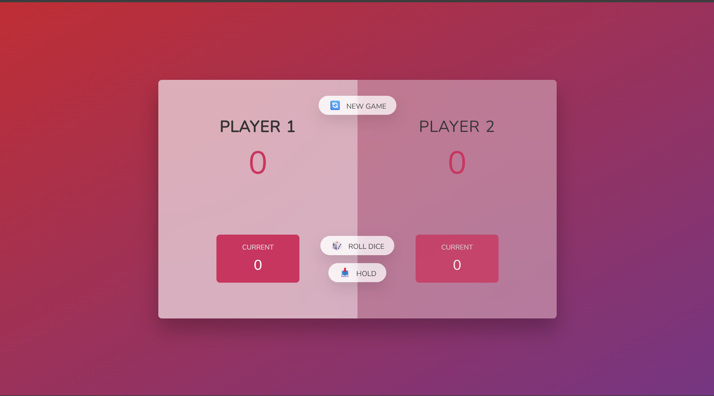

# Pig Game JS

An interactive dice game to practice DOM manipulation and game logic.

## Features

- Roll dice and accumulate points
- Switch players automatically
- Determine winner
- Reset game

## Tech Stack

- JavaScript (ES6+)
- HTML & CSS
- DOM & Events

### 📝 Note

This project is part of the **JavaScript Course by Jonas Schmedtmann**.

---

## 🖼️ Screenshots

### Main Page

